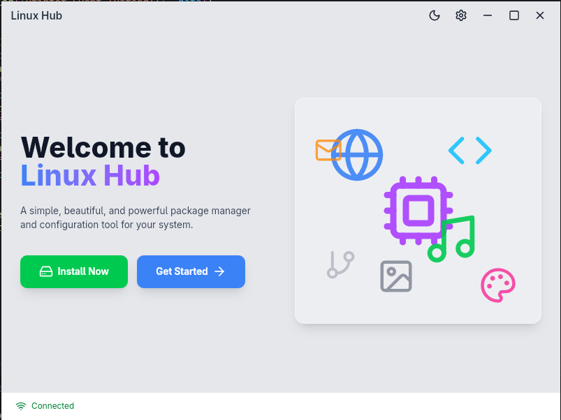
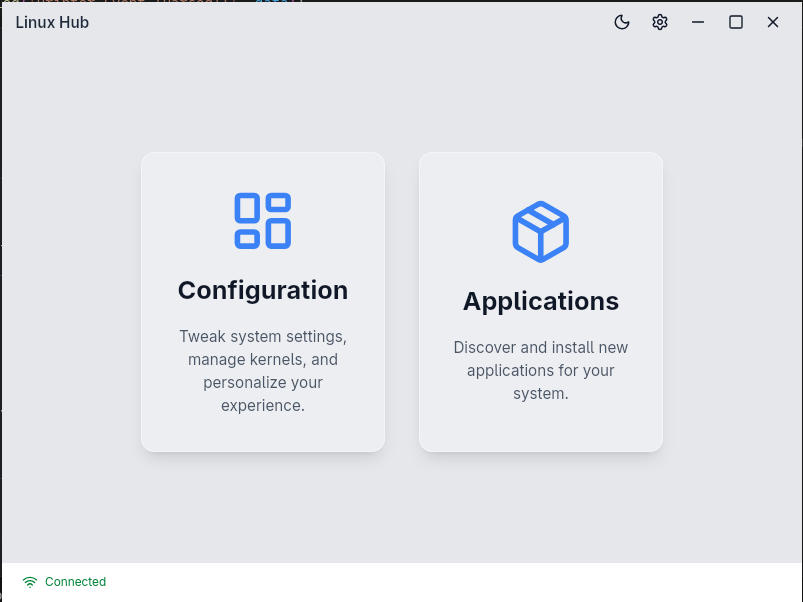
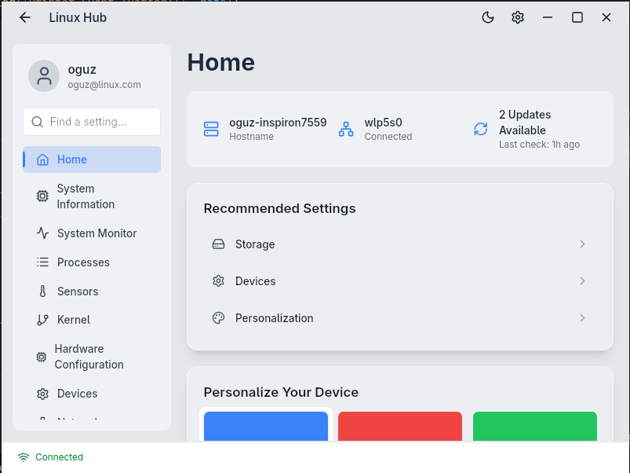
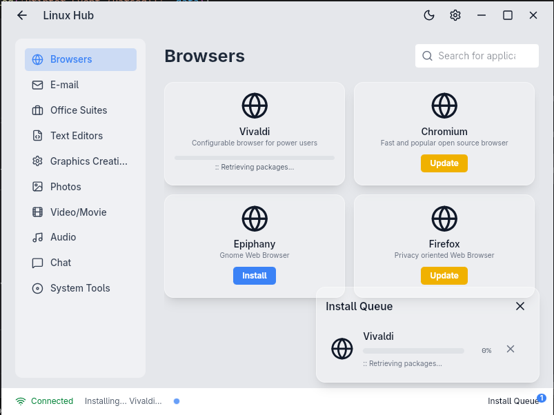

[](https://www.codefactor.io/repository/github/oguzkaganeren/linuxhub)


<!-- PROJECT LOGO -->
<br />
<p align="center">
  <a href="https://github.com/oguzkaganeren/linuxhub">
    
  </a>

  <h3 align="center">LinuxHub</h3>

  <p align="center">
    A tool providing access to documentation and support for new linux users.
    <br />
    <br />
    <br />
    <a href="https://github.com/oguzkaganeren/linuxhub/">View Demo</a>
    ·
    <a href="https://github.com/oguzkaganeren/linuxhub/issues">Report Bug</a>
    ·
    <a href="https://github.com/oguzkaganeren/linuxhub/issues">Request Feature</a>
    ·
    <a href="https://github.com/oguzkaganeren/linuxhub/pulls">Send a Pull Request</a>
  </p>
</p>

<!-- ABOUT THE PROJECT -->
## About The Project

<p float="left"> 




</p>

## Features
- System Information: View detailed information about your system hardware and software.
- Package Management: Search, install, and remove packages.
- Configuration: Manage system settings, such as locales, printers, and network.
- System Monitoring: Monitor system processes, sensors, and storage.
- User Management: Add, remove, and manage users.

<!-- USAGE EXAMPLES -->
## Installations

You can download the latest release from the [releases page](https://github.com/oguzkaganeren/linuxhub/releases).

### Arch Linux

```sh
yay -S linuxhub
```

## Dependencies

### Frontend
- React
- Redux
- Tailwind CSS
- i18next
- Framer Motion

### Backend
- Tauri
- Serde
- Tokio
- Chrono
- Sysinfo

### Built With

- [React](https://reactjs.org)
- [Tauri](https://tauri.studio)
- [Rust](https://www.rust-lang.org/)
- [TypeScript](https://www.typescriptlang.org/)

<!-- GETTING STARTED -->
## Getting Started

To get a local copy up and running follow these steps.

### Prerequisites

- yarn
- [Tauri Prerequisites](https://tauri.app/v1/guides/getting-started/prerequisites#setting-up-linux)
- cargo

### Installation

1. Clone the repo
   ```sh
   git clone https://github.com/oguzkaganeren/linuxhub.git
   ```
2. Install NPM packages
   ```sh
   yarn install
   ```
3. Run debug mode
   ```sh
   yarn tauri dev
   ```

### Vscode

1. Install suggested vscode extensions(`.vscode/extensions.json`)
2. Press F5 or Run -> Start Debugging

## Logs location
Logs are located at `~/.config/linuxhub/logs`.

<!-- ROADMAP -->
## 🚧 Roadmap

See the [open issues](https://github.com/oguzkaganeren/linuxhub/issues) for a list of proposed features (and known issues).

<!-- CONTRIBUTING -->
## 🤝 Contributing

Contributions are what make the open source community such an amazing place to be learn, inspire, and create. Any contributions you make are **extremely appreciated**.

1. Fork the Project
2. Create your Feature Branch (`git checkout -b feature/AmazingFeature`)
3. Commit your Changes (`git commit -m 'Add some AmazingFeature'`)
4. Push to the Branch (`git push origin feature/AmazingFeature`)
5. Open a Pull Request

### Translations

1. Save as `src/translations/en.json` with your local json name
2. Translate only values(do not change keys)
3. Import it at i18n.ts file and add it to resources variable
4. Run `yarn tauri dev` and check your changes
5. Commit all changes
6. Send pull request

<!-- LICENSE -->
## 📝 License

Distributed under the GNU License. See `LICENSE.md` for more information.

<!-- CONTACT -->
## 📫 Contact

Project Link: [https://github.com/oguzkaganeren/linuxhub](https://github.com/oguzkaganeren/linuxhub)

<!-- ACKNOWLEDGEMENTS -->
## Contributors