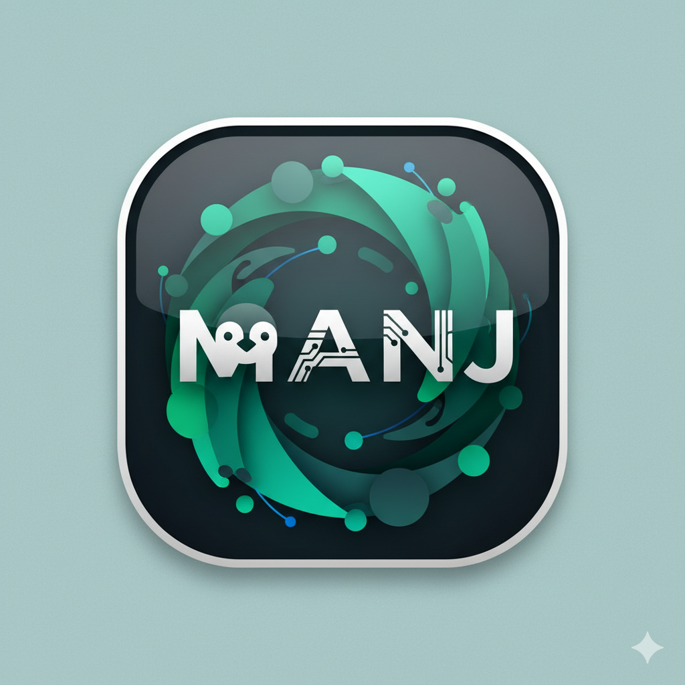

[](https://www.codefactor.io/repository/github/oguzkaganeren/manj)


<!-- PROJECT LOGO -->
<br />
<p align="center">
  <a href="https://github.com/oguzkaganeren/manj">
    
  </a>

  <h3 align="center">Manj</h3>

  <p align="center">
    A tool providing access to documentation and support for new linux users.
    <br />
    <br />
    <br />
    <a href="https://github.com/oguzkaganeren/manj/">View Demo</a>
    ·
    <a href="https://github.com/oguzkaganeren/manj/issues">Report Bug</a>
    ·
    <a href="https://github.com/oguzkaganeren/manj/issues">Request Feature</a>
    ·
    <a href="https://github.com/oguzkaganeren/manj/pulls">Send a Pull Request</a>
  </p>
</p>

<!-- ABOUT THE PROJECT -->

## About The Project

<p float="left"> 


</p>

## Features

<!-- USAGE EXAMPLES -->

## Installations

## Dependencies

### Dependency(Optional)

### Used

### Built With

- [React](https://reactjs.org)
- [Tauri](https://tauri.studio)

<!-- GETTING STARTED -->

## Getting Started

To get a local copy up and running follow these steps.

### Prerequisites

- yarn
- https://tauri.app/v1/guides/getting-started/prerequisites#setting-up-linux
- cargo

### Installation

1. Clone the repo

```sh
git clone https://github.com/oguzkaganeren/manj.git
```

2. Install NPM packages

```sh
yarn install
```

3. Run debug mode

```sh
yarn tauri dev
```

#### Vscode

1. Install suggested vscode extensions(`.vscode/extensions.json`)
2. Press F5 or Run -> Start Debugging

## Logs location

<!-- ROADMAP -->

## 🚧 Roadmap

See the [open issues](https://github.com/oguzkaganeren/manj/issues) for a list of proposed features (and known issues).

<!-- CONTRIBUTING -->

## 🤝 Contributing

Contributions are what make the open source community such an amazing place to be learn, inspire, and create. Any contributions you make are **extremely appreciated**.

1. Fork the Project
2. Create your Feature Branch (`git checkout -b feature/AmazingFeature`)
3. Commit your Changes (`git commit -m 'Add some AmazingFeature'`)
4. Push to the Branch (`git push origin feature/AmazingFeature`)
5. Open a Pull Request

### Translations

1. Save as `src/translations/en.json` with your local json name
2. Translate only values(do not change keys)
3. Import it at i18n.ts file and add it to resources variable
4. Run `yarn tauri dev` and check your changes
5. Commit all changes
6. Send pull request

<!-- LICENSE -->

## 📝 License

Distributed under the GNU License. See `LICENSE.md` for more information.

<!-- CONTACT -->

## 📫 Contact

Project Link: [https://github.com/oguzkaganeren/manj](https://github.com/oguzkaganeren/manj)

<!-- ACKNOWLEDGEMENTS -->

## Contributors
